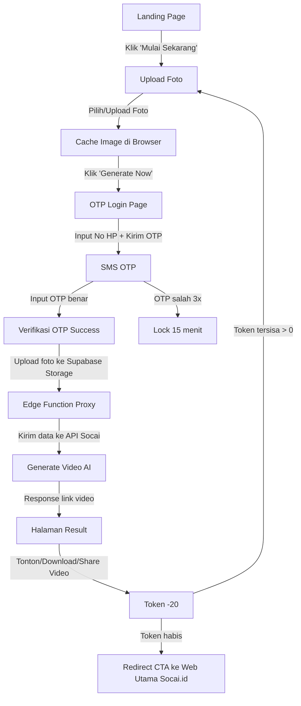

# User Flow – Mini App Socai.id

---

## 1. Landing Page

* User melihat headline **“Selamat! Kamu mendapatkan 50 Token Socai 🎉”**.
* CTA utama: **“Mulai Sekarang”**.

## 2. Upload Foto

* User upload 1 foto.
* Foto sementara disimpan di **cache browser**.
* Tombol **“Generate Now”** → diarahkan ke OTP login.

## 3. OTP Login

* Input nomor HP (default +62).
* User request OTP via SMS.
* Input kode OTP.
* Jika OTP benar → lanjut.
* Jika OTP salah 3x → lock 15 menit.

## 4. Generate Video

* Setelah OTP sukses:

  * Foto dari cache diupload ke **Supabase Storage** (bucket `socai`).
  * URL publik foto + prompt + `creator_id` dikirim ke **Supabase Edge Function**.
  * Edge Function → request ke **API Socai** (video AI generator).

## 5. Hasil Video

* User diarahkan ke halaman result.
* Video tampil (player + tombol **Download** & **Share**).
* Token berkurang -20.

## 6. Token Flow

* Token awal: **50** (cukup untuk 2 video).
* Jika token masih ada → bisa ulangi flow dari Upload Foto.
* Jika token habis → diarahkan ke halaman **CTA “Langganan Sekarang di Socai.id”**.

---